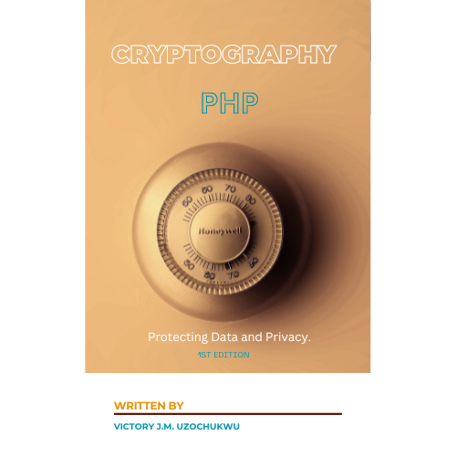

# CMS Signer Library

The CMS Signer Library is a PHP utility for signing files using Cryptographic Message Syntax (CMS). It provides a simple interface to sign data and ensure its integrity and authenticity.

## Features

- Easy-to-use CMS/PKCS7 signing, encrypting, decrypting and signature-verifying functionality
- Built-in logging with Monolog
- Exception handling for robust error management

## Requirements

- PHP 7.4 or higher
- OpenSSL extension enabled
- Composer for dependency management

## Installation

Use Composer to install the library:

```bash
composer require gobuy/gobuy_php_encryption
```

## Usage

To use the CMS Signer, you need to include the Composer autoload file and start invoking class members with the instance `$gobuy`  class name is `GoBuyEncryption` incase you prefer a different class object name. The class constructor takes no argument.

```php

require 'vendor/autoload.php'; 

```

## Usage

Check if OpenSSL module is loaded.

```php

// Load the OpenSSL module
if (!extension_loaded('openssl')) {
    die('OpenSSL extension is not loaded.');
}

```
For Laravel users. You have to inject our object through one of your methods to be able to work with the class members as shown below. Or you could simple instantiate our class:
```php

public function index( Request $req, GoBuyEncryption $gobuy ) {

      $gobuy->init(); // This method has to be called first if you choose this pattern. If you instantiate our class, you don't need to call this method

}  

```
For output dispalys and display of OpenSSL errors we have provided the below for your convinience:
```php

// Load the OpenSSL module
$gobuy->output( "Some output message", "Title of the output" ); // Display errors if string or var_dumps if an array.
$gobuy->showAnyError( ); // Displays all openssl_error_string()

```
For Laravel users, the root path `$this->getRoot()` stops in the direction where the laravel App folder and vendor are. Make sure the App folder and the vendor are in that same directory for this class method to serve properly. So that you can say:
```php

// Load the OpenSSL module
$root = $gobuy->getRoot( ); // 
$gobuy->create($root."app/CMS") // This helper helps you create new folders.
$gobuy->setInputFilename($root."app/CMS/data.txt"); // You must have left "data.txt" in the folder "CMS".

```

#### To sign a file
You must set the necessary paths to the files you wish to work with before signing, encrypting, decrypting, and verifying.
```php

/**
 *  The input and output files could be ".cms". Not just ".txt"
 *  Do not use "file://" just "./folder/file.txt" for example.
 */


// Set the input filename for the data to be signed
$gobuy->setInputFilename($root."app/CMS/data.txt");

// Set the output filename where the CMS signed data will be saved
$gobuy->setCMSOutputFilename($root."app/path/to/CMS/signed_data.cms");

// Set the path to the sender's certificate
$gobuy->setSenderCertPath($root."app/path/to/sender/certificate.pem");

// Set the path to the sender's private key
$gobuy->setSenderPrivateKey($root."app/path/to/sender/private_key.pem", "12345");

// Or
// Set the password for the sender's private key, then call "setSenderPrivateKey" with only first argument.
$gobuy->setPrivateKeyPassword("12345");

// Optional: Set email headers for the S/MIME message
// Below are optional
$gobuy->setCMSEncoding( OPENSSL_ENCODING_SMIME ); 
$gobuy->setCMSCipherAlgo( OPENSSL_CIPHER_AES_128_CBC );

$gobuy->setHeader([
    "From" => "sender@example.com",
    "To" => "recipient@example.com",
    "Subject" => "Signed Data"
]);


```
We are securing you with chain of trust. So we generate an intermediate certificate for the `$untrusted_certificates_filename`. This is typically done to provide additional layer of security and also more certificates that will be needed to complete the verification process.
```php

// Set the path where the intermediate output will be saved.
$gobuy->setIntermediateCertPath( $root."app/path/to/intermediate_cert.pem" ); // ".pem" or ".crt". ".crt".

// 
list($intermediateCert, $intermediatCertPath, $intermediatePrivateKey ) = $gobuy->generateIntermediateCert( $root."app/path/to/sender/private_key.pem" );

// Now the end entity's certificate can be created. End entity is also the sender. The sender needs to submit a Certificate Signing Request (CSR) for a certificate to be issued to them.
$days = 365; // How long the certificate will be valid. You can increase this further
$serial = rand(); // Just any random number, for example.
list( $endEntityCert ) = $gobuy->signEndEntityCert( $root."app/path/to/sender/csr.pem", 
                                $intermediatCertPath, $intermediatePrivateKey, 
                                  $days, $serial );

// set $untrusted_certificates_filename. This is needed to verify the sender's 
$gobuy->setUntrustedCertificatesFilename( $intermediateCertPath );

```
Where `$intermediateCert` is the certificate content from file, and `$intermediateCertPath` is the path to the certificate content. `generateCSR` takes the path to the sender's private key. `setUntrustedCertificatesFilename` sets `$untrusted_certificates_filename`. `$endEntityCert` is same as the `$senderCert`.


#### To encrypt a file

```php

// Here you must have invoke the setters like above
if ( $gobuy->cmsSign( $endEntityCert ) ) {
    // This scope means a digital signature was established successfully.
    $gobuy->getCMSSigned(); // Get signed certificate data;

    // Preparing for encryption
    // Set the output filename where the CMS. encrypted data will be saved
    $gobuy->setCMSEncryptedOutput( $root."app/path/to/encrypted_data.cms" );
    // Set the path to recipient's certificate.
    $gobuy->setRecipientCertPath( $root."app/path/to/recievers/certificate.pem" );
    // Set the path to the recipient's private key.
    $gobuy->setRecipientPrivateKey( $root."app/path/to/recievers/private_key.pem", "12345" ); // Password-protected
    
    // Encrypt the signed data using CMS. 
    $gobuy->cmsEncrypt($root."path/to/signed_data.cms"); 
      $gobuy->getCMSEncrypted(); // Get the encrypted data

} else {
    throw new \Exception( "Signing failed: " . openssl_error_string() );
}


```
#### Padding
We will effortlessly pad your encrypted data. This stage is well recommended to give the encryped data more complex structure and randomness. This is to make the encrypted more resistant to brute force attack, and other attacks that exploit the simplicity of cryptographic cipher texts. 
```php
 $gobuy->paddCMSEncrypted(); // Pad the encrypted data before sending (recommended)
```
```php
// Blade 
  @php
      $gobuy->unPadCMSEncrypted(); // unpad the padded encrypted data before the decryption stage.
 @endphp
```

### Cascading
We cascade encryption stages to strengthen your digital footprints, and secure your digigtal presence. This also makes it very hard for the man-in-the-middle or any other cryptoanalyst to figure out the key with brute force. If you desire more layers of encryption on the already existing encryption (which we recommend) then simply call the method `hardden(...)`.
```php
      $harddened = $gobuy->harden( $encryptedData, $aVeryStrongPassPhrase );
```
On the receiving side just easily call the method `unhardden()` to return back to working with `$encrypted`data.
```php
  //Blade
    @php
      $encryptedData = $gobuy->unharden( $harddened );
    @endphp
```
After hashing a password, simply call this method to help disfigure the password more, making it harder to detect.
```php
  $disfiguredPass = $gobuy->disfigurePass( $password );
```
Call the below method to reverse this.
```php
  $gobuy->passRebuild( $disfiguredPass );
```

It is recommended to compress the file before it takes flight. This will reduce the file size and prevent any latency due to file being too large. If you believe you are working with a small file, you may want to skip this stage of encryption. Below shows how we can effortlessly compress your file after encryption.
```php
// Begin the compression process and create a new ZIP file named "comp.zip".
$gobuy->compressData("comp.zip")
    ->thenAddFileFromString("index.txt", "echo 'Hello, world!' ") // Add a file from a string with the name "index.php" containing a simple PHP echo statement.
    ->thenAttach("comp.zip", "pic/dog.jpg")// Attach an image file "dog.jpg" from the "pic" directory to the ZIP archive.
    ->thenAttach("comp.zip", "pic/car.png") // Attach another image file "car.png" from the "pic" directory to the ZIP archive.
    ->thenAttach("comp.zip", "docs/doc.pdf") // Attach a PDF document "doc.pdf" from the "docs" directory to the ZIP archive.
    ->thenAfterCloseZip();  // Finalize the ZIP archive and close it.
```

You may now proceed as follows:
```php

// Begin the compression process and create a new ZIP file named "comp.zip".
$gobuy->compressData("encryption.zip")
    // Attach an image file "dog.jpg" from the "pic" directory to the ZIP archive.
    ->thenAttach("encryption.zip", $root."app/encrypted/encrypted_data.cms")
    // Finalize the ZIP archive and close it.
    ->thenAfterCloseZip();


```

```php
// This is the reciever's end, who will now decrypt the file.
// Continuation from above. Ensure to have called all relevant setters here.
if (  $gobuy->cmsEncrypt($root."app/path/to/signed_data.cms") ) {

    // Set the output filename where the decrypted data will be saved
    $gobuy->setDecryptedData($root."app/path/to/decrypted_data.cms");

    // Decrypt the CMS encrypted data
    $gobuy->cmsDecrypt($root."app/path/to/encrypted_data.cms");
    $gobuy->getDecryptedDataRaw(); // Get the decrypted data.

} else {
    throw new Exception ( "Something went wrong" );
}

```
For Laravel users, the client side may look something like below. Now remember that in most cases, it is the client who is the sender. Where the server receives and decrypts, authenticates the user and so on.
```php

<body class="antialiased">
        @inject('gobuy', 'App\Services\GoBuy')

        <!-- {{ $gobuy->getCMSSignedData() }} -->
        @php
        
            
            $gobuy->setRecipientCertPath( $gobuy->getRoot()."app/bob_cred/certificate.crt" );
            $gobuy->setRecipientPrivateKey( $gobuy->getRoot()."app/bob_cred/private_key.key", "12345" );

            $gobuy->setDecryptedData( $gobuy->getRoot()."app/data/decrypted_data.cms" );
            $gobuy->cmsDecrypt($gobuy->getRoot()."app/data/encrypted_data.cms");
            //echo $gobuy->getDecryptedDataRaw(); // Get the decrypted data.

            // Here is where the CA certificate is added to the caInfo array.
            $gobuy->caInfo = [ $root."app/path/to/ca.crt" ];
            if ($gobuy->cmsVerify ( $gobuy->getDecryptedData(), 
                                $gobuy->getRoot()."app/data/cms_content_data.pem", // Where the original message will be stored after it is detached from the signature.
                                $gobuy->getRoot()."app/data/cms_signature_data.pem" )) // Where the signature is stored after it is ditached from the original message.
            {
                $gobuy->output( "CMS VERIfied", "Verified!!" );
            } else {
                $gobuy->output( "CMS Not VERIfied ". openssl_error_string(), "Not Verified!!" );
                $gobuy->showAnyError();
            }

        @endphp
    </body>

```

```php

// public function cmsVerify( string $decryptedData, string $output,
//                                 string|null $sigfile = null,
//                                 array $caInfo = [],
//                                 string|null $untrustedCertificatesFilename = null,
//                                 string|null $content = null,
//                                 string|null $pk7 = null,
//                                 int $encoding = OPENSSL_ENCODING_SMIME ): bool | int {


```

The second argument of `cmsVerify` shows the original content (the human-readable message) before signature was signed, that is after the signature is detached. The third argument is a file that holds the detached signature.
You could just push the encrypted data from through Laravel's view method as below:
```php
return view('welcome', [ "encrypted" => $gobuy->getCMSEncrypted() ]);
```
```php

  //Blade
  {{ $encrypted }}
```
## Using PKCS7 System

```php

// Set the input filename for the data to be signed using PKCS7
$gobuy->setInputFilename("path/to/data.txt"); // Holds just plain text.

// Set the output filename where the PKCS7 signed data will be saved
$gobuy->setPKCS7SignedOutputFilename("./path/to/signed_data.cms");

// Set the path to the sender's certificate for PKCS7 signing
$gobuy->setSenderCertPath("path/to/sender/certificate.pem");

// Set the path to the sender's private key for PKCS7 signing
$gobuy->setSenderPrivateKeyPath("path/to/sender/private_key.pem");

// Optional: Set email headers for the S/MIME message for PKCS7
$gobuy->setHeader([
    "From" => "sender@example.com",
    "To" => "recipient@example.com",
    "Subject" => "Signed Data"
]);


// Sign the data using PKCS7
if ($gobuy->pkcs7Sign()) {
    // Set the output filename where the PKCS7 encrypted data will be saved
    $gobuy->setPKCS7EncryptedOutputFilename("./path/to/pkcs7_encrypted_data.cms");

    // Set the path to the recipient's certificate for PKCS7 encryption
    $gobuy->setRecipientCertPath("path/to/recipient/certificate.pem");

    // Generate recipient credentials for PKCS7 encryption
    // $gobuy->generateRecipientCredentials();

    // Encrypt the signed data using PKCS7
    if ($gobuy->pkcs7Encrypt()) {
        // Rest of your code
    }
}

```
Same as above
```php
@php
// Set the output filename where the PKCS7 decrypted data will be saved
$gobuy->setPKCS7DecryptedOutputFilename("./path/to/pkcs7_decrypted_data.cms");

// Set the path to the recipient's certificate for PKCS7 decryption
$gobuy->setRecipientCertPath("path/to/recipient/certificate.pem");

// Set the path to the recipient's private key for PKCS7 decryption
$gobuy->setRecipientPrivateKey("path/to/recipient/private_key.pem");

// Decrypt the PKCS7 encrypted data
if ($gobuy->pkcs7Decrypt($gobuy->getPKCS7EncryptedOutputFilename())) {
    // Set the output filename where the PKCS7 original message will be saved
    $gobuy->setPKCS7RawDataOutput( "./path/to/data_pkcs7_content." );

    // Set the path where the detached signature will be saved.
    $gobuy->setPKCS7SignatureOutput( "./path/to/data_pkcs7_signature." );

    // Verify the PKCS7 decrypted data
    $gobuy->pkcs7Verify($gobuy->getPKCS7DecryptedOutputFilename());
}

@endphp
```

## Alternatively
In the context of the class you're working with, the methods `generateRecipientCredentials()` and `generateSenderCredentials()` can be designed to simplify the process of generating credentials. When invoked, these methods can internally create a certificate and a private key for the recipient and sender, respectively. This feature is particularly useful if you prefer not to manually create and manage certificate files and private key files on the filesystem.

Here's an example of how to invoke these methods:

```php
      ...

    list( $recipientRawCert, $recipientPrivateKey ) = $gobuy->generateSenderCredentials( $config, $dn, $expiresIn  )
           
    
```
In most cases, the receiver is the server that will decrypt and authenticate user data.
```php
  @php
    list( $recipientRawCert, $recipientPrivateKey ) = $gobuy->generateRecipientCredentials( $config, $dn, $expiresIn  )
  @endphp
```
```php 
 //Where 
        $config = array(
            "digest_alg" => "sha512", // Digest algorithm for the certificate signature
            "private_key_bits" => 4096, // Number of bits for the private key
            "private_key_type" => OPENSSL_KEYTYPE_RSA, // Type of private key to create
        )

        $dn = array(
            "countryName" => "AU", // Country name
            "stateOrProvinceName" => "...", // State or province name
            "localityName" => "...", // Locality name
            "organizationName" => "...", // Organization name
            "organizationalUnitName" => "...", // Organizational unit name
            "commonName" => "www.", // Common name, usually the domain name
            "emailAddress" => "..." // Email address
        ),
        $expiresIn = 365

```

When using these methods, you don't need to worry about file paths or handling certificate files directly. The method takes care of generating the necessary credentials and using them in subsequent cryptographic operations. This makes the process more streamlined and user-friendly, especially for those who may not be familiar with the details of certificate and key management.

Here are the definitions for the `generateSenderCredentials` and `generateRecipientCredentials` methods with comments explaining each parameter:

```php
class GoBuyEncryption
{
    // ... (other class properties and methods)

    /**
     * Generates a new certificate and private key for the sender.
     * 
     * @param array $config Configuration options for the private key and certificate.
     * @param array $dn The Distinguished Name to be used in the certificate.
     * @param int $expiresIn The number of days for the certificate to be valid.
     * 
     * @return void
     */
    public function generateSenderCredentials(
        array $config = array(
            "digest_alg" => "sha512", // Digest algorithm for the certificate signature
            "private_key_bits" => 4096, // Number of bits for the private key
            "private_key_type" => OPENSSL_KEYTYPE_RSA, // Type of private key to create
        ),
        $dn = array(
            "countryName" => "AU", // Country name
            "stateOrProvinceName" => "...", // State or province name
            "localityName" => "...", // Locality name
            "organizationName" => "...", // Organization name
            "organizationalUnitName" => "...", // Organizational unit name
            "commonName" => "www.", // Common name, usually the domain name
            "emailAddress" => "..." // Email address
        ),
        int $expiresIn = 365 // Certificate validity period in days
    ) {
        // Logic to generate sender's certificate and private key
        // ...
    }

    /**
     * Generates a new certificate and private key for the recipient.
     * 
     * @param array $config Configuration options for the private key and certificate.
     * @param array $dn The Distinguished Name to be used in the certificate.
     * @param int $expiresIn The number of days for the certificate to be valid.
     * 
     * @return void
     */
    public function generateRecipientCredentials(
        Array $config = array(
            "digest_alg" => "sha512", // Digest algorithm for the certificate signature
            "private_key_bits" => 4096, // Number of bits for the private key
            "private_key_type" => OPENSSL_KEYTYPE_RSA, // Type of private key to create
        ),
        Array $dn = array(
            "countryName" => "...", // Country name
            "stateOrProvinceName" => "...", // State or province name
            "localityName" => "...", // Locality name
            "organizationName" => "...", // Organization name
            "organizationalUnitName" => "... ", // Organizational unit name
            "commonName" => "...", // Common name, usually the domain name
            "emailAddress" => "..." // Email address
        ),
        int $expiresIn = 365 // Certificate validity period in days
    ) {
        // Logic to generate recipient's certificate and private key
        // ...
    }

    // ... (other class properties and methods)
}
```

These methods are designed to be flexible, allowing you to specify different configurations and distinguished names for the sender and recipient. The `$config` array allows you to define the cryptographic parameters for the certificate and private key generation, while the `$dn` array contains the information that will be included in the subject field of the certificate. The `$expiresIn` parameter sets the validity period of the certificate in days. These methods abstract away the complexity of generating and managing cryptographic credentials, making it easier to implement secure communication in your application.

## DiffieHellman
In our encryption class, we firmly believe in incorporating the Diffie-Hellman authentication stage as a crucial step before decryption begins. This authentication process, which involves the server and the user, plays a vital role in ensuring the security and integrity of the encrypted communication. Here's why we consider it necessary:
1. **Mutual Authentication**:
The Diffie-Hellman authentication stage facilitates mutual authentication between the server and the user. By verifying each other's identities, both parties can establish trust and confidence before proceeding with the decryption process. This mutual authentication helps prevent unauthorized access and protects against man-in-the-middle attacks. Refer to our book on "Encryption" to learn more on this kind of attack, where we discussed it with the necessary examples.

2. **Protection against Replay Attacks**:
Including Diffie-Hellman authentication protects against replay attacks. With authentication in place, each communication session generates a unique session key that is used exclusively for that session. This prevents replay attacks, where an adversary intercepts and replays previously captured encrypted data, as the session key changes for each session.

4. **Defense against Impersonation**:
By incorporating the Diffie-Hellman authentication stage, we mitigate the risk of impersonation attacks. Through the authentication process, both the server and the user verify their respective identities, ensuring that the encryption and decryption operations take place between the intended parties. This protects against malicious individuals attempting to impersonate either the server or the user.

```php

<?php

namespace App\Services;
use GoBuy\Encryption\GoBuyEncryption;
class GoBuy extends GoBuyEncryption{
   
    public function serverSharedSecret (  ): string {
        $server =  $this->getDH();  // Calling constructor of DiffieHellman
        $user =  $this->getDH();  
        $serverSharedSecret = $server->computeSharedSecret($user->getPublicKey()); // Servers secrete.
        return $serverSharedSecret;
    }

}

```
This should be reversed when authenticating a user's encrypted message. The user will then encrypt, and the server will authenticate and decrypt.

#### In Laravel
You could still consider our solution in a normal `index.php` script or other PHP frameworks. Then you will need your composer properly setup, and setting the path to your `autoload.php`.
```php

  @php

            $serverSharedSecret = $gobuy->serverSharedSecret();
            $server =  $gobuy->getDH();  
            $user =  $gobuy->getDH();
            $userSharedSecret = $user->computeSharedSecret($server->getPublicKey());

            if ( $serverSharedSecret===$userSharedSecret )
            {
                // Do your decryption here
            } else throw new \Exception( "Something went wrong: ". openssl_error_string() );

  @endphp

```

## All Class Properties 

Here's an explanation of the fields in the `GoBuyEncryption` class:


# GoBuyEncryption Class Fields


- `protected $inputFilename = null;`
  - **Type**: `null`
  - **Description**: Initially unset, this variable is intended to hold the path to the input file.

- `protected $cmsOutputFilename = 'gobuy_signed_data_6.cms';`
  - **Type**: `string`
  - **Description**: Path to the output file containing signed data.

- `protected $extraCertsPath = 'path/to/extra_certs.pem';`
  - **Type**: `string`
  - **Description**: Path to additional certificates if required.

- `protected $privateKeyPassword = '12345';`
  - **Type**: `string`
  - **Description**: Specifies the password for accessing the private key.

- `protected $header = [];`
  - **Type**: `array`
  - **Description**: An associative array representing the headers for the CMS operation.

- `protected $cmsFlag = OPENSSL_CMS_BINARY;`
  - **Type**: `int`
  - **Description**: A bitmask of flags for the CMS signing operation.

- `protected $cmsEncoding = OPENSSL_ENCODING_SMIME;`
  - **Type**: `int`
  - **Description**: The encoding type for the CMS signing operation.

- `protected $untrusted_certificates_filename = null;`
  - **Type**: `string|null`
  - **Description**: The filename of additional untrusted certificates for the CMS operation.

- `protected $log;`
  - **Type**: `Logger`
  - **Description**: Monolog logger instance for logging messages.

- `protected $senderInnerGenCert = 'gobuy_cipher/sender_certificate.pem';`
  - **Type**: `string`
  - **Description**: Path to the sender's certificate file.

- `protected $recipientInnerGenCert = 'gobuy_cipher/reciever_certificate.pem';`
  - **Type**: `string`
  - **Description**: Path to the recipient's certificate file.

- `protected $senderInnerGenKey = 'gobuy_cipher/sender_private_key.pem';`
  - **Type**: `string`
  - **Description**: Path to the sender's protected key file.

- `protected $recipientInnerGenKey = 'gobuy_cipher/reciever_private_key.pem';`
  - **Type**: `string`
  - **Description**: Path to the recipient's protected key file.

- `protected $pkcs7Flag = PKCS7_BINARY;`
  - **Type**: `int`
  - **Description**: Flag for PKCS7 operation mode.

- `protected $pkcs7Algo = OPENSSL_CIPHER_AES_256_CBC;`
  - **Type**: `string`
  - **Description**: Algorithm used for PKCS7 encryption.

- `protected $errorLogPath = './log/cms_signing.log';`
  - **Type**: `string`
  - **Description**: Path to the error log file for CMS signing.

- `protected $pkcs7EncryptedOutputFilename;`
  - **Type**: `string`
  - **Description**: Filename for the PKCS7 encrypted output.

- `protected $pkcs7DecryptedOutputFilename;`
  - **Type**: `string`
  - **Description**: Filename for the PKCS7 decrypted output.

- `protected $pkcs7SignedOutputFilename;`
  - **Type**: `string`
  - **Description**: Filename for the PKCS7 signed output.

- `protected $senderRawCert;`
  - **Type**: `string`
  - **Description**: Raw certificate data for the sender.

- `protected $recipientRawCert;`
  - **Type**: `string`
  - **Description**: Raw certificate data for the recipient.

- `protected $senderPrivateKey;`
  - **Type**: `resource`
  - **Description**: Protected key resource for the sender.

- `protected $cmsSigned = "Empty";`
  - **Type**: `string`
  - **Description**: Status of CMS signing, initially empty.

- `protected $pkcs7Signed = "Empty";`
  - **Type**: `string`
  - **Description**: Status of PKCS7 signing, initially empty.

- `protected $senderCertificate;`
  - **Type**: `string`
  - **Description**: Certificate data for the sender.

- `protected $recipientPrivateKey;`
  - **Type**: `resource`
  - **Description**: Protected key resource for the recipient.

- `protected $cmsEncryptedOutPut;`
  - **Type**: `string`
  - **Description**: Output for CMS encrypted data.

- `protected $recipientCertificate;`
  - **Type**: `string`
  - **Description**: Certificate data for the recipient.

- `protected $recipientCertPath = "./gobuy_cipher/recipient_cert.pem";`
  - **Type**: `string`
  - **Description**: Path to the recipient's certificate file.

- `protected $pkcs7EncryptedOutput;`
  - **Type**: `string`
  - **Description**: Output for PKCS7 encrypted data.

- `protected $decryptedData;`
  - **Type**: `string`
  - **Description**: Decrypted data after processing.

- `protected $decryptionOutput;`
  - **Type**: `string`
  - **Description**: Output filename for decrypted data.

- `public $decryptedOutput;`
  - **Type**: `string`
  - **Description**: Publicly accessible property for decrypted output.

- `protected $pkcs7RawDataOutput;`
  - **Type**: `string`
  - **Description**: Output for PKCS7 verified data.

- `private $intermediatePrivateKey;`
  - **Type**: `string`
  - **Description**: Holds the private key of the intermediate certificate authority (CA).

- `private $caCert;`
  - **Type**: `string`
  - **Description**: Contains the certificate of the certificate authority (CA).

- `protected $generateRecipientCredentials = false;`
  - **Type**: `bool`
  - **Description**: Indicates whether to generate credentials for the recipient.

- `protected $generateSenderCredentials = false;`
  - **Type**: `bool`
  - **Description**: Indicates whether to generate credentials for the sender.

- `protected $cmsCipherAlgo = OPENSSL_CIPHER_AES_128_CBC;`
  - **Type**: `int`
  - **Description**: Specifies the cipher algorithm to be used for CMS.

- `protected $pkcs7Encoding;`
  - **Type**: `mixed`
  - **Description**: Defines the encoding for PKCS#7 data structures.

- `protected $senderPrivateKeyPath;`
  - **Type**: `string`
  - **Description**: Path to the private key file of the sender.

- `private $recipientTempCert;`
  - **Type**: `string`
  - **Description**: Temporary certificate for the recipient.

- `private $pkcs7SignatureOutput;`
  - **Type**: `string`
  - **Description**: Stores the output of the PKCS#7 signature process.


Each field is described with its purpose and the type of data it holds. This documentation provides clarity on the role of each field within the `GoBuyEncryption` class, making it easier for developers to understand and work with the class.

## Exception Handling

The CMS Signer throws exceptions if there are issues with file signing. Make sure to handle these exceptions in your application.

## Initial Work

The CMS Signer Library was created to provide developers with an easy-to-use solution for signing files using Cryptographic Message Syntax (CMS). It simplifies the process of ensuring data integrity and authenticity in PHP applications. The initial release includes core signing features, comprehensive error handling, and integration with Monolog for logging.


## Contributing

Contributions are welcome. Please submit pull requests to the repository.

## License

This library is open-sourced under the MIT license. See the LICENSE file for details.

## Support

For support, please open an issue in the GitHub repository.

## Author

- Victory J.M. Uzochukwu - Creator and Lead Developer - [codingdrips1on1](https://github.com/codingdrips1on1/GoBuyEncryption/tree/main)

Main Contributors: [GoBuy.cheap](https://www.gobuy.cheap) and  [CodingDrips.eu](https://www.codingdrips.eu) 

## Books for your information.
____________
You may proceed to get a copy [here](https://www.gobuy.cheap/integrated-web-and-mobile-development)
____________


